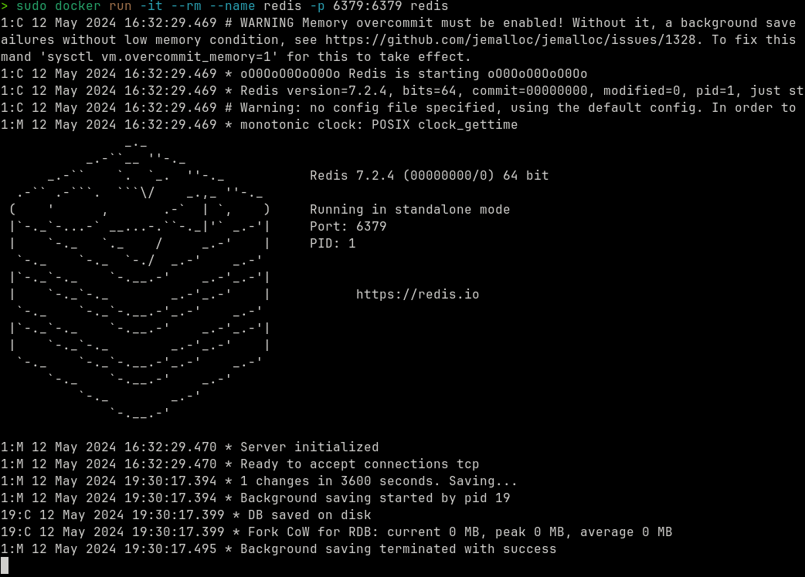

# Final OS project using Django Channels

### Contributors:  
[PIDGORNYI Mykyta](https://github.com/InWamos)  
[GULIDA Roman](https://github.com/roman-gulida)
[Taiem Ahmad](https://github.com/Taiem3)
[Mazilu Stefan](https://github.com/Stefan1007)

# Used Technologies:
- Redis
- PostgreSQL
- Django
- Django Channels
- Django REST

# Admin Login Credentials:
```
admin
```

```
admin88**
```
# Install dependencies:
```
pip3 install -r requirements.txt
```

# Launch Redis in docker
```
docker run -it --rm --name redis -p 6379:6379 redis
```

# Login form preview

